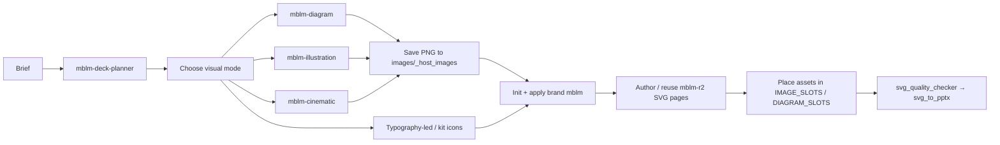

# STEP 4 — MBLM media stack integration (final)

Canonical orchestration for Steps 1–3: **mblm-r2** SVG deck + **mblm-diagram** + **mblm-illustration** + **mblm-cinematic**, tied into Path A Quick Generate.

| Authority | Path |
|---|---|
| This guide | `docs/STEP4_INTEGRATION.md` |
| Alumni copy-paste prompts | `docs/ALUMNI_PROMPTS_IMAGERY.md` (Prompt **MASTER** / **LOCAL**) |
| Install merge | `docs/INSTALL_ALUMNI.md` |
| Shipping / zips | `docs/SHIPPING.md` |
| Changelog | `docs/CHANGELOG_MBLM.md` |

Step notes: `STEP1_R2_SVG_TEMPLATES.md` · `STEP2_MBLM_DIAGRAM.md` · `STEP3_MBLM_IMAGES.md`.

---

## Turn 0 — deck plan first (mandatory Alumni default)

Before visuals or PPTX, run nested skill **`skills/mblm-deck-planner/`**:

1. Ingest conversation memory, docs, URLs, screenshots, datasets, instructions.
2. Output an ordered slide **PLAN only** (YAML/JSON per `skills/mblm-deck-planner/references/OUTPUT_SCHEMA.md`).
3. Do **not** generate PPTX in Turn 0.
4. Copy-paste: `skills/mblm-deck-planner/PROMPT_ALUMNI.md`.

Then continue Turn 1 (visuals) → Turn 2 (ppt) below.

## End-to-end flow



ASCII (same path):

```text
brief
  → Turn 0: mblm-deck-planner (slide map only)
  → choose visuals (diagram | illustration | photo | typography/kit)
  → generate PNGs → projects/_host_images/  (diagram_ / illustration_ / photo_)
  → init project --quick-generate
  → apply_template brand mblm
  → author/reuse templates/decks/mblm-r2 pages (SOURCE_MAP)
  → place assets into IMAGE_SLOTS / DIAGRAM_SLOTS wells
  → svg_quality_checker → svg_to_pptx --quick-generate
```

---

## Visual chooser

From `references/mblm/IMAGES_GEN.md` + `DIAGRAMS.md`:

| Need | Prefer | Prefix | Hosts |
|---|---|---|---|
| Cover / section / closing atmosphere | **mblm-cinematic** | `photo_<slug>.png` | Full-bleed heroes; `IMAGE_SLOTS` ★ r2_13 / cover kit |
| Abstract strategy / capability metaphor | **mblm-illustration** (exactly one accent) | `illustration_<slug>.png` | Centered wells; r2_17 / title_content |
| Process / methodology / phases as monoline art | **mblm-diagram** | `diagram_<slug>.png` | `DIAGRAM_SLOTS` ★ r2_19,22,23,27,30,32 |
| Small chrome / bullets / ornaments | **Kit icons** SVG | — | Layout chrome only |
| Simple numbered steps already in r2 geometry | Native shapes | — | Fill labels only |
| Agenda / dense tables / matrices | Typography-led | — | Avoid large AI art (r2_40,34–36) |

Hard constraints: never mix illustration accents; never recolor diagrams; full-bleed photos only on cover/section/closing unless brief says otherwise.

---

## Alumni recipe (mandatory default): Turn 0 plan → Turn 1 visuals → Turn 2 ppt

Avoids Alumni **400 spawn** when stacking visual Skill Scripts with `mblm-ppt-master` in one turn.
Copy-paste: planner `PROMPT_ALUMNI.md` + **Prompt MASTER** in `docs/ALUMNI_PROMPTS_IMAGERY.md`.

### Turn 0 — plan only

- Load `skills/mblm-deck-planner/` only.
- Emit slide map (layout_id, title, body, visual_mode, image_prompt/filename, notes).
- Facts only — no invented KPIs. Agenda = `39_r2_40_section_agenda` only.

### Turn 1 — visuals only

- Load nested style refs only: `skills/mblm-diagram/`, `skills/mblm-illustration/`, `skills/mblm-cinematic/` (or top-level equivalents if nested pack missing).
- Generate all needed PNGs.
- Save under `projects/_host_images/` with prefixes:
  - `diagram_<slug>.png`
  - `illustration_<slug>.png`
  - `photo_<slug>.png`
- **Do not** init/export PPTX; **do not** run `mblm-ppt-master` Skill Script this turn.

### Turn 2 — deck only

- Use **only** `mblm-ppt-master`.
- `attribution_guard` → `project_manager init … --quick-generate` → `apply_template … --root templates/brands/mblm`.
- Prefer deck layouts from `templates/decks/mblm-r2/` (see layout picker below).
- Place existing `_host_images` into wells; §VIII Acquire Via=`user`.
- Export via `svg_to_pptx --quick-generate`.
- **Do not** spawn visual Skill Scripts this turn.

---

## Single-agent / local recipe

One chat where the engine owns Image_Generator. Copy-paste: **Prompt LOCAL**.

1. Load `SKILL.md` → guard → `MBLM_OVERLAY.md` → freeze refs.
2. Use nested `skills/mblm-*/SKILL.md` (+ prompt templates) as **style references** only — no parallel Alumni visual Skill Scripts.
3. Emit prompts via CLIs (below) or `PROMPT_TEMPLATE.md`; generate into project `images/` (+ `_host_images` if used).
4. Apply brand `mblm`; author/reuse `mblm-r2`; place; export.

If image gen fails for diagrams, place SVG from `assets/mblm/diagrams/`.

---

## How to pick an r2 layout

1. **SOURCE_MAP** — `templates/decks/mblm-r2/SOURCE_MAP.md`: SVG ↔ r2 id ↔ source PNG. Gold (SVG catalog): **r2_40** section agenda.
2. **IMAGE_SLOTS** — photo/illustration hosts (`IMAGE_SLOTS.md`).
3. **DIAGRAM_SLOTS** — process monoline hosts (`DIAGRAM_SLOTS.md`).
4. Match slide job → r2 id / file stem (e.g. `39_r2_40_section_agenda`) or `data-pptx-layout`.
5. Kit fallbacks: `assets/mblm/layouts/MBLM_process.svg`, `MBLM_process_timeline.svg`, `MBLM_title_picture.svg`, etc. (not required in the lean step4 zip beyond `layouts/r2`).

---

## Prompt CLIs index

All scripts **emit prompts only** (stdlib; no image APIs).

```bash
cd "${SKILL_DIR}"   # skill root

# Diagram
python3 scripts/mblm_diagram_prompt.py \
  --archetype inbound \
  --topic "Inbound engine" \
  --steps "Attract|Convert|Nurture|Close|Delight"

# Illustration
python3 scripts/mblm_illustration_prompt.py \
  --topic "Brand system as a city" \
  --accent yellow --background white \
  --action "tiny figures walk between typography blocks" \
  --shapes "towers, grids, arched portals"

# Cinematic
python3 scripts/mblm_cinematic_prompt.py \
  --subject "two silhouettes" --action "walking toward light" \
  --location "empty urban plaza at dusk" \
  --light "low sun" --motion still --face obscured
```

Optional `--write path.json` for §VIII / image_prompts fragments.

| Skill | Style refs |
|---|---|
| Diagram | `skills/mblm-diagram/SKILL.md`, `PROMPT_TEMPLATE.md`, `references/` |
| Illustration | `skills/mblm-illustration/SKILL.md`, `PROMPT_TEMPLATE.md`, `PALETTE.md` |
| Cinematic | `skills/mblm-cinematic/SKILL.md`, `PROMPT_TEMPLATE.md`, `CHECKLIST.md` |

---

## Install paths (Alumni)

Lean add-on: `/workspace/mblm-ppt-master-step4-media-stack.zip` (or same name shipped to you).

Unzip into an **existing** `mblm-ppt-master` / Alumni skill root so these exist:

```text
skills/mblm-diagram/
skills/mblm-illustration/
skills/mblm-cinematic/
templates/decks/mblm-r2/
assets/mblm/diagrams/
assets/mblm/layouts/r2/          # real SVG files in zip (symlinks materialized)
references/mblm/DIAGRAMS.md
references/mblm/IMAGES_GEN.md
references/mblm/LAYOUTS.md
scripts/mblm_*_prompt.py
docs/STEP1…STEP4, ALUMNI_PROMPTS_IMAGERY.md, INSTALL_ALUMNI.md, CHANGELOG_MBLM.md, SHIPPING.md
```

Then:

```bash
cd /path/to/mblm-ppt-master   # skill root
python3 scripts/register_template.py mblm-r2 --kind deck
python3 -c "import json; assert 'mblm-r2' in json.load(open('templates/decks/decks_index.json'))"
python3 scripts/attribution_guard.py   # must exit 0
```

Full merge commands: `docs/INSTALL_ALUMNI.md`. Full engine still lives in the prior full-fixed package — this zip is a **media+templates add-on**, not a replacement for `scripts/` / brand workspace.

---

## Verify checklist

- [ ] `mblm-r2` in `templates/decks/decks_index.json`
- [ ] `python3 scripts/attribution_guard.py` exits 0
- [ ] All three `mblm_*_prompt.py` run (`--help` or sample args)
- [ ] 40 SVGs under `templates/decks/mblm-r2/templates/`
- [ ] Nested skills present under `skills/mblm-*`
